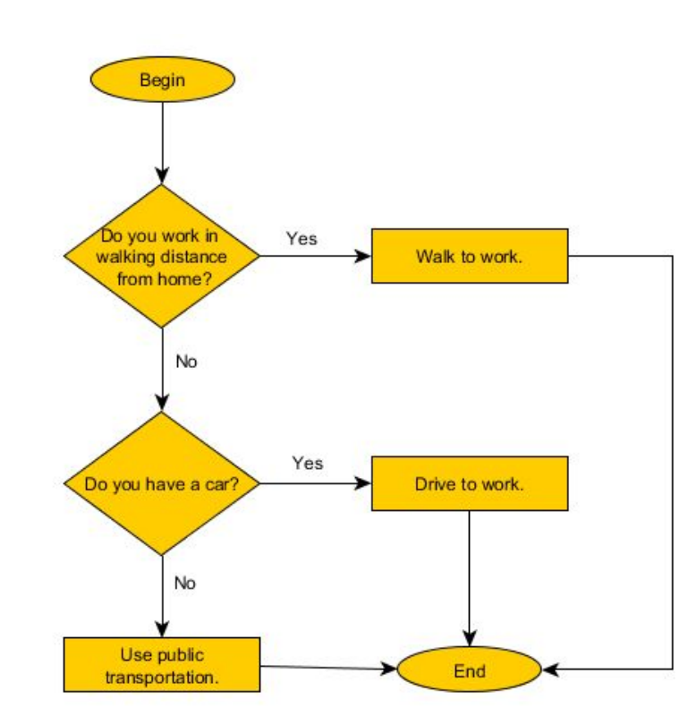
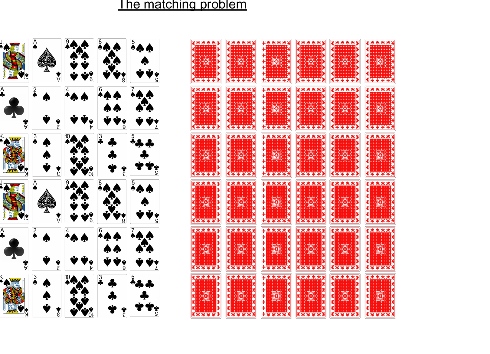
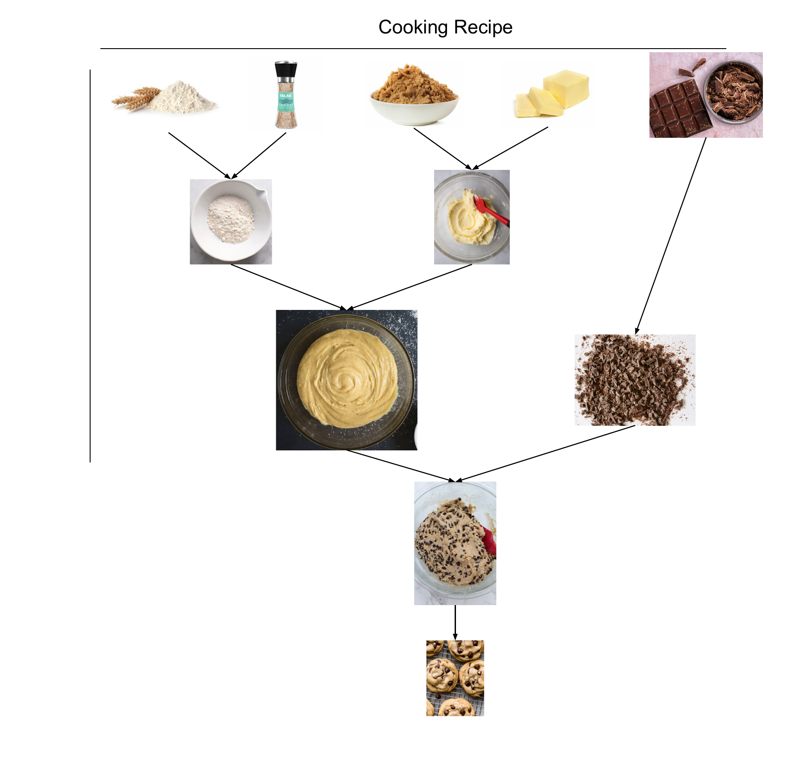

# Non-Coding Motivating Examples

---

## 1. What is an Algorithm?

An **algorithm** is a procedure to solve a problem: a series of steps that, when followed,
solve a specific problem.

A problem has two components:

- **Input**
- **Desired output**

Key ideas:

- Inputs have **sizes**.
- The size of the input can affect the **number of steps (time)** needed to solve the problem.
- The relationship between **input size** and **time to solve** is the key focus of this course.

### Example: an everyday algorithm (how do I get to work?)

A flowchart *is* an algorithm — a fixed series of steps/decisions with an input and an output.



**Discuss:**

- What is the *input* to this algorithm?  _
- What is the *desired output*? ______
- Does the input "size" change the number of steps here? ______

---

## 2. Poker: Analyzing Algorithms on a Deck of Cards

For each problem below, decide:

- **What is N?** (the input size)
- **Best case** — the fewest steps you could get lucky with
- **Average case** — the steps for a "typical" input
- **Worst case** — the most steps you could be forced to take

Fill in the table together:

| Problem to Solve                                      | What is N?        | Best case | Average case | Worst case     |
| ----------------------------------------------------- | ----------------- | --------- | ------------ | -------------- |
| Find the ace of spades                                | __（N）52__ | 1         | 26/27        | N              |
| Count the cards in a deck                             | 52                | 52        | 52           | 52             |
| Check if the deck is in sorted order (4–A, 4–1, …) | 52                | 1         | ______       | ____52__ |
| Check if a box of cards has cards inside              | 1                 | 1         | 1            | 1              |
| Solve the matching problem —**brute force**    | ______            | ______    | ______       | ______         |
| Solve the matching problem —**perfect memory** | ______            | ______    | ______       | ______         |

### The Matching Problem

Cards are laid out **face down** in a grid. On each turn you flip **two** cards:

- If they **match**, remove the pair.
- If they **don't match**, flip them back face down.

Goal: clear the whole board by matching every pair.



---

## 3. Recipes and Running Time

### A recipe is an algorithm too

A cooking recipe is a series of steps with inputs (ingredients) and a desired output (the dish).
Notice that some steps are **independent** (can be done in any order / in parallel) while others
have **dependencies** (must wait for an earlier step).



### How running time grows with input size

Some algorithms get slower **much** faster than others as N grows. Keep **halving** 1024:

```
1024 → 512 → 256 → 128 → 64 → 32 → 16 → 8 → 4 → 2 → 1
```

That took **10** halvings, because **log₂(1024) = 10**.

- An algorithm that **halves** the problem each step takes about **log₂(N)** steps → very fast growth.
- For a tiny input (e.g. **N = 5**), the run times of different algorithms are ______ (basically the same) — Big-O only matters as N gets **large**.
- A sort like Tim Sort does about **N · log(N)** work — written `log(n) * n`.
