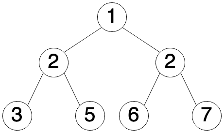

# Question Two: Path to Leaves

Given the `root` of a binary tree, return all root to leaf paths in any order.

## Examples

### Example 1



Input: `root = [1, 2, 2, 3, 5, 6, 7]` *What traversal method is this?*

Output: [[1, 2, 3], [1, 2, 5], [1, 2, 6], [1, 2, 7]]

### Example 2


Input: `root = [10, 9, 8, 7]`

Output: [[10, 7], [10, 9, 8]]

## Starter Code

```
# Definition for a binary tree node.
# class TreeNode(object):
#     def __init__(self, val = 0, left = None, right = None):
#         self.val = val
#         self.left = left
#         self.right = right
def bt_path(root: TreeNode) -> List[List[int]]:
    # TODO
```
